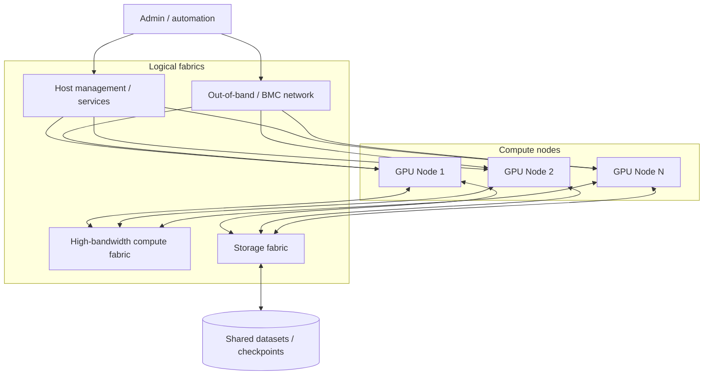

# AI Cluster Fabrics

Production AI infrastructure often separates traffic by purpose. This high-level diagram is a reference model, not a claim about the physical home lab.

## Why separate paths?

- management traffic has different availability/security needs than collective GPU traffic
- storage traffic has different congestion and throughput patterns
- BMC/out-of-band access should survive failures that make the host OS unreachable
- high-performance compute traffic may use Ethernet/RoCE or InfiniBand depending on design

Use **Fabric-Faultline** to turn these boxes into packet paths and failure domains.