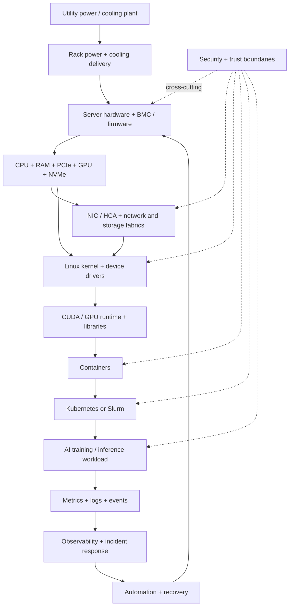

# End-to-End AI Infrastructure Stack

This is the top-level mental model for the entire learning plan.

## Questions to ask at every boundary

- What crosses this boundary: power, heat, packets, DMA, system calls, API requests, credentials, or telemetry?
- What fails on each side?
- What evidence confirms the boundary is healthy?
- Who or what owns recovery?

As the plan progresses, replace generic boxes with links to measured evidence from the standalone projects.