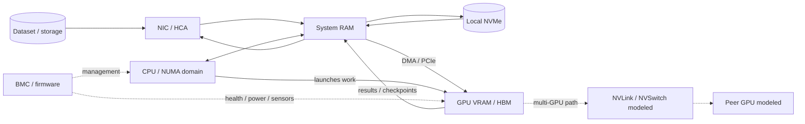

# GPU Node Data Path

A simplified compute-node view. Multi-GPU/NVSwitch pieces are **modeled/reference architecture** unless measured on actual hardware.

## Performance questions

1. Is data waiting on storage?
2. Is CPU preprocessing keeping up?
3. Is the transfer crossing an unfavorable NUMA/PCIe path?
4. Is GPU memory capacity/bandwidth the limit?
5. Is peer-to-peer or network communication the limit?

This diagram is the conceptual bridge between **Topology-Faultline**, **Checkpoint-Rush**, **Blackbox-GPU**, and **Silicon-Tetris**.