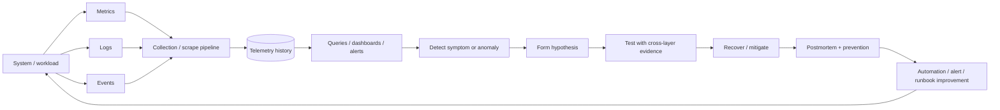

# Observability and Incident Loop

## Important distinction

A dashboard is not observability by itself. Useful incident work requires enough history and context to answer:

- what changed first?
- what was normal before the event?
- what else changed at the same time?
- which layer produced the earliest useful signal?

This loop connects **Blackbox-GPU**, **Checkpoint-Rush**, **Phoenix-Node**, and **Lazarus-Cluster**.