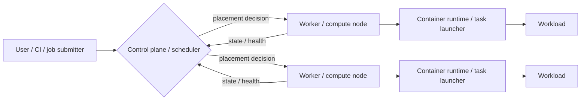

# Orchestration Control Planes

Kubernetes and Slurm differ significantly, but both separate **decision-making** from **work execution**.



## Kubernetes mapping

```text
API server/controllers/scheduler → kubelet → container runtime → pod/container
```

## Slurm mapping

```text
slurmctld → slurmd → job step/task
```

The point is not to pretend the systems are identical. The diagram creates a common set of questions:

- who holds desired/requested state?
- who decides placement?
- who advertises node resources?
- who actually launches the workload?
- what happens when the control plane is unavailable?

Use **Scheduler-Colosseum** for the comparison and **Lazarus-Cluster** for failure/recovery behavior.