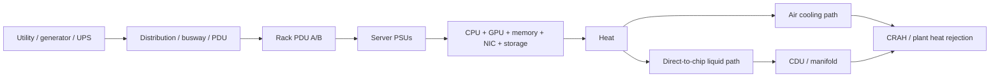
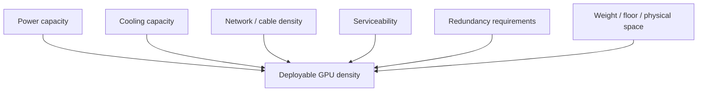

# Rack Power and Cooling

A high-level physical path showing how electrical capacity becomes compute and then heat that must be removed.

## Constraints meet at the rack

**Atlas-Rack** explores these tradeoffs directly; **Silicon-Tetris** turns several of them into capacity constraints.