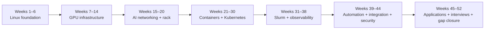
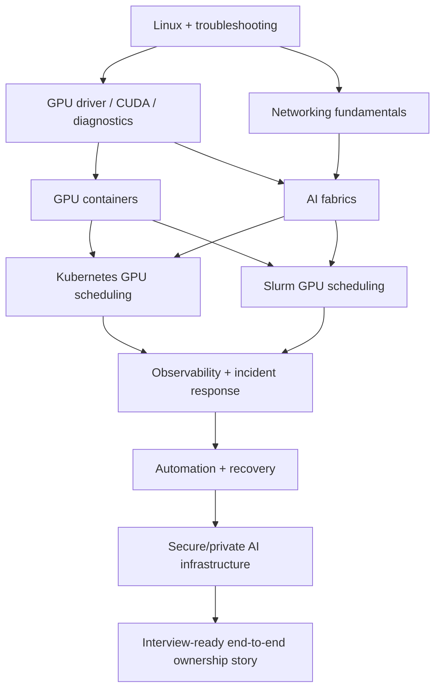

# Visual 52-Week Roadmap

The detailed checklist lives in Notion. This page is the **one-screen mental map** of how the technical layers build on one another and where the standalone portfolio projects enter.

## Phase flow

## Skills accumulate rather than reset

## Portfolio project timeline

```mermaid
flowchart TB
    W1[1–6 Linux] --- PHX[Phoenix-Node]
    W2[7–14 GPU] --- TOP[Topology-Faultline]
    W2 --- BLK0[Blackbox-GPU baseline]
    W3[15–20 Network / rack] --- FAB[Fabric-Faultline]
    W3 --- ATL[Atlas-Rack]
    W3 --- SIL1[Silicon-Tetris constraints]
    W4[21–30 Containers / K8s] --- SCH1[Scheduler-Colosseum]
    W4 --- LAZ1[Lazarus-Cluster begins]
    W5[31–38 Slurm / observability] --- SCH2[Scheduler-Colosseum concludes]
    W5 --- BLK[Blackbox-GPU]
    W5 --- CHK[Checkpoint-Rush]
    W5 --- LAZ2[Lazarus-Cluster]
    W6[39–44 Automation / security] --- PHX2[Phoenix final rebuild]
    W6 --- LAZ3[Lazarus final recovery]
    W6 --- SIL2[Silicon-Tetris final model]
    W6 --- PRIV[Private-AI-Foundry]
```

## Milestone gates

| Gate | What should now be demonstrable |
|---|---|
| **Week 6** | Administer and troubleshoot a Linux server without GUI dependence |
| **Week 14** | Explain GPU node architecture and validate/diagnose the NVIDIA software stack |
| **Week 20** | Trace an AI fabric and reason about rack power/cooling/interconnect constraints |
| **Week 24** | Run and reproduce a GPU-enabled container environment |
| **Week 30** | Schedule a GPU workload through Kubernetes |
| **Week 34** | Schedule a GPU workload through Slurm and compare scheduler tradeoffs |
| **Week 38** | Reconstruct a GPU/infrastructure incident from telemetry |
| **Week 40** | Rebuild a useful component through repeatable automation |
| **Week 42** | Explain the integrated architecture across layers |
| **Week 44** | Present an interview-ready portfolio and security/private-AI story |
| **Week 52** | Compete for GPU/HPC/AI-infrastructure roles and close gaps from real interviews |

For the exact project mission schedule, see [`lab-schedule.md`](lab-schedule.md).